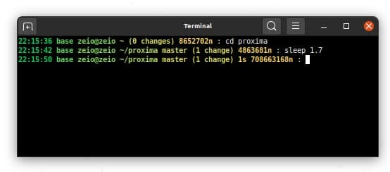
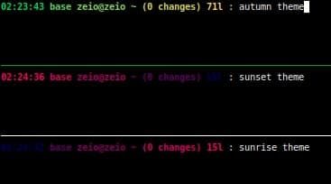

# Colorful prompt

Project that allows you to set up a better prompt which arguably is more beatiful than the default one and provides you more information about your environment.




# Installation

The script mainly relies on the `lua` interpreter and `git` tool, so they both must be installed in your system for the new prompt to work. 

Also it is of the major importance to **disable the default conda environment name output** using the following command:

```sh
conda config --set changeps1 false
```

Finally, to enable the new look you need to update your `.bashrc` configuration file (which is located in the home directory as well) by including the following line in the end (the script's argument is optional and it contains the name of the color scheme to apply in case you want to customize it; all color schemes and their names, as well as the default scheme name are defined in the file `get-scheme-colors.sh`):

```sh
source $HOME/colorful-prompt/colorful-prompt.sh sunset
```

